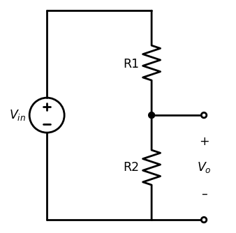

# LightFish


Version: 0.0.1 - 07/07/2023


## New features

- New `dataset` for the model
- Based on `Falcon Model` to create new experiences

## Example



``` python
import schemdraw
from schemdraw import elements as elm

with schemdraw.Drawing() as d:
    
    d += (r1 := elm.Resistor().down().label('R1').dot())
    d += elm.Line().right(d.unit/2).dot(open=True)
    d += elm.Gap().down().label(['+', '$V_o$', '–'])
    d += elm.Line().left(d.unit/2).idot(open=True)
    d += elm.Resistor().up().label('R2').hold()
    d += elm.Line().left()
    d += elm.SourceV().toy(r1.start).label('$V_{in}$')
    d += elm.Line().tox(r1.start)

    d.draw()
```

### License 

© All rights reserved LightFish 2023

Founder: Dardo Altobelli

Co-founder: Maximo Rulli